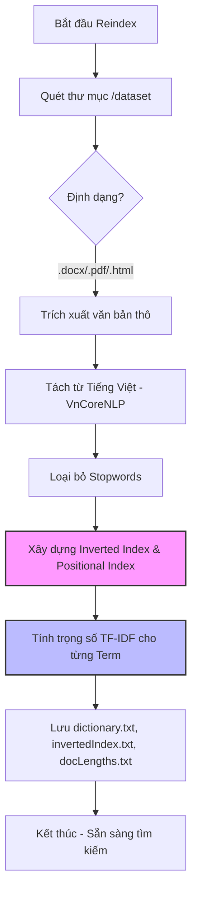
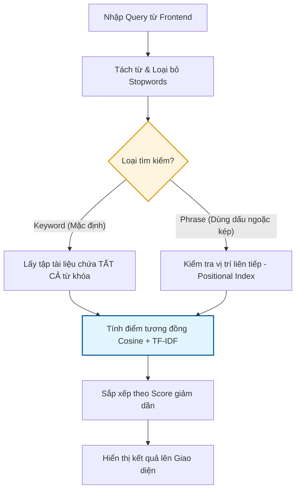
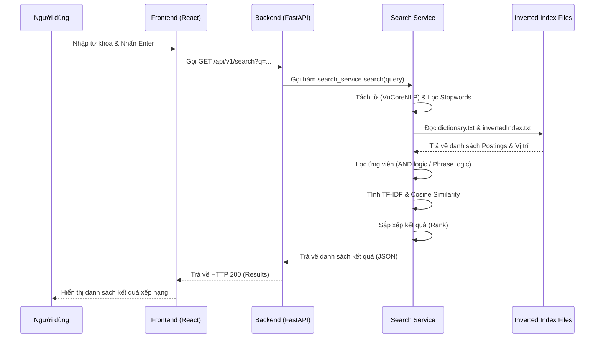

# GooSearch - Hệ thống Tìm kiếm Web Đơn giản

GooSearch là một hệ thống công cụ tìm kiếm tài liệu (Information Retrieval System) được xây dựng dựa trên **Mô hình Không gian Vector (Vector Space Model)**. Dự án tập trung vào việc xử lý tiếng Việt, hỗ trợ tìm kiếm từ khóa thông thường và tìm kiếm mệnh đề chính xác.

---

## 🗺️ Sơ đồ hoạt động (Workflows)

Hệ thống hoạt động dựa trên hai quy trình chính: **Lập chỉ mục (Offline)** và **Tìm kiếm (Online)**.

### 1. Quy trình Lập chỉ mục (Indexing Process)
Quy trình này quét toàn bộ dữ liệu thô và chuyển đổi thành cấu trúc dữ liệu tối ưu cho việc tìm kiếm.



### 2. Quy trình Tìm kiếm & Xếp hạng (Search & Ranking)
Quy trình xử lý truy vấn từ người dùng và trả về kết quả đã được sắp xếp.



### 3. Sơ đồ trình tự Tìm kiếm (Search Sequence Diagram)
Sơ đồ này mô tả cách các thành phần giao tiếp với nhau khi người dùng thực hiện tìm kiếm.



### 4. Các bước xử lý trong Search Logic
1.  **Tiền xử lý Truy vấn:** Chuyển câu hỏi của người dùng về dạng token chuẩn (ví dụ: `Hệ thống` -> `hệ_thống`) bằng VnCoreNLP.
2.  **Truy xuất Ứng viên (Retrieval):** Tìm tập hợp các tài liệu chứa từ khóa. Hệ thống thực hiện phép giao (Intersection) giữa các danh sách Postings.
3.  **Hậu lọc (Filtering):** Nếu là tìm kiếm cụm từ (Phrase Search), hệ thống dựa vào **Positional Index** để lọc ra các tài liệu có từ đứng cạnh nhau theo đúng thứ tự.
4.  **Tính toán Trọng số (Weighting):** Sử dụng công thức **TF-IDF** để định giá trị cho từng từ trong câu hỏi và tài liệu.
5.  **Tính điểm Tương đồng (Similarity):** Thực hiện phép nhân vô hướng giữa vector truy vấn và vector tài liệu, chia cho tích độ dài để tính **Cosine Similarity**.
6.  **Sắp xếp & Phân trang:** Trả về danh sách kết quả giảm dần theo điểm số để hiển thị lên màn hình (mặc định 10 kết quả mỗi trang).

---

## 🔍 Các kiểu Tìm kiếm & Xếp hạng

### 1. Các kiểu Tìm kiếm
Hệ thống tự động nhận diện kiểu tìm kiếm dựa trên nội dung nhập vào:
*   **Tìm kiếm Từ khóa (Keyword Search):** Tìm các tài liệu chứa đồng thời các từ khóa (logic AND), không quan trọng thứ tự. Ví dụ: `máy tính xách tay`.
*   **Tìm kiếm Mệnh đề (Phrase Search):** Tìm chính xác cụm từ theo đúng thứ tự và vị trí đứng cạnh nhau. Kích hoạt bằng cách để nội dung trong dấu ngoặc kép. Ví dụ: `"máy tính xách tay"`.

### 2. Thuật toán Xếp hạng (Ranking)
Hệ thống sử dụng tổ hợp các kỹ thuật IR (Information Retrieval) kinh điển:
*   **TF-IDF (Term Frequency - Inverse Document Frequency):** Đánh giá mức độ quan trọng của một từ trong tài liệu. Từ nào xuất hiện nhiều trong một bài nhưng hiếm trong toàn bộ kho dữ liệu sẽ có trọng số cao.
*   **Cosine Similarity:** Đo lường độ tương đồng giữa vector câu hỏi và vector tài liệu. Tài liệu nào có "hướng" gần với câu hỏi nhất sẽ được ưu tiên lên đầu.

---

## 🛠️ Công nghệ sử dụng

*   **Backend:** Python 3.10+, FastAPI, `PyVnCoreNLP` (dựa trên Java 8 CLI).
*   **Frontend:** React 19, Vite, Tailwind CSS, Framer Motion (Hiệu ứng mượt mà).
*   **Chỉ mục:** Inverted Index (Lập chỉ mục ngược) dạng file văn bản (.txt).

---

## 🚀 Hướng dẫn cài đặt

### 1. Yêu cầu
- Đã cài đặt Python 3.10 trở lên.
- Đã cài đặt Node.js và npm.
- Đã cài đặt Java JDK 8 (Bắt buộc để chạy VnCoreNLP).

### 2. Cài đặt Backend
1. Cài đặt thư viện:
   ```bash
   pip install -r requirements.txt
   ```
2. Chạy server API:
   ```bash
   python run_api.py
   ```

### 3. Cài đặt Frontend
1. Cài đặt thư viện:
   ```bash
   cd frontend && npm install
   ```
2. Khởi động giao diện:
   ```bash
   npm run dev
   ```

---

## 👨‍🎓 Thông tin sinh viên
- **Họ tên:** Võ Khương Duy
- **Mã số sinh viên:** 2513464
- **Môn học:** Tìm kiếm thông tin - Mô hình Không gian Vector (VSM)

---
*Dự án thực hành Buổi 2 - Thạc sĩ Tìm kiếm thông tin.*
