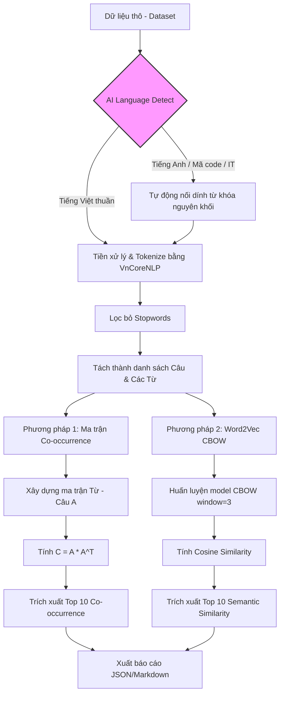

# Thực hành 03: Xây dựng Danh mục Từ đồng xuất hiện

Bài tập này triển khai việc tìm kiếm 10 từ đồng xuất hiện cao nhất của một từ truy vấn bằng hai phương pháp: **Ma trận đồng xuất hiện truyền thống** và **Nhúng từ (Word Embedding) với CBOW**.

---

## Sơ đồ hoạt động (Workflow)



---

## Yêu cầu hệ thống & Cài đặt

### 1. Yêu cầu phần mềm
*   **Python**: Phiên bản 3.9+ 
*   **Java**: JDK 1.8+ (Bắt buộc để chạy VnCoreNLP)
*   Thư viện: `numpy`, `scipy`, `gensim`, `py_vncorenlp`, `python-docx`, `pdfminer.six`, `beautifulsoup4`.

### 2. Cài đặt môi trường
1.  **Cấu hình Java**: Đảm bảo đường dẫn `JAVA_HOME` trong file `utils.py` trỏ đúng vào thư mục cài đặt JDK của bạn.
2.  **Cài đặt thư viện**:
    ```bash
    pip install -r requirements.txt
    ```

---

## Hướng dẫn chạy chương trình

Để thực hiện toàn bộ quy trình và xem kết quả, bạn chỉ cần chạy file main:

```bash
python main.py
```

### Kết quả đầu ra:
*   `results.json`: Chứa kết quả thô dạng JSON.
*   `results.md`: Báo cáo so sánh Top 10 từ của 2 phương pháp dưới dạng bảng.
*   `word2vec_cbow.model`: Model Word2Vec đã được huấn luyện.

---

## Mô tả kỹ thuật

### Phương pháp 1: Ma trận đồng xuất hiện
*   **Ma trận A (Binary)**: Mỗi hàng là một từ, mỗi cột là một câu. Giá trị là 1 nếu từ xuất hiện trong câu.
*   **Ma trận C**: Kết quả của phép nhân $A \times A^T$. Phần tử $C[i][j]$ cho biết số lần từ $i$ và từ $j$ cùng xuất hiện trong một câu.

### Phương pháp 2: Word2Vec (CBOW)
*   Sử dụng mô hình **Continuous Bag of Words** (CBOW).
*   **Kích thước cửa sổ (Window size)**: 3 (xem xét 3 từ trước và 3 từ sau).
*   Ý nghĩa: Tìm các từ có sự tương đồng về mặt ngữ nghĩa (semantic similarity) dựa trên ngữ cảnh xung quanh thay vì chỉ đếm số lần xuất hiện thuần túy.

---

## Kết quả thử nghiệm
Chương trình tập trung thử nghiệm với 2 từ khóa chính:
1.  **window xp**: (Tự động xử lý các biến thể 'windows_xp', 'window_xp'...)
2.  **phần mềm**: (Xử lý từ ghép tiếng Việt với VnCoreNLP thành 'phần_mềm')

---
*Bản quyền thực hành: Tìm kiếm thông tin - Chương trình Thạc sĩ*
